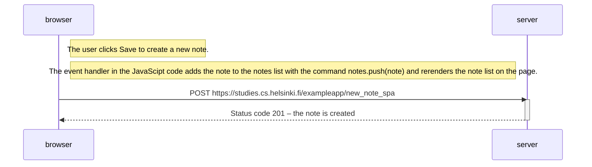

```mermaid
sequenceDiagram
    participant browser
    participant server

    Note right of browser: The user clicks Save to create a new note.

    Note right of browser: The event handler in the JavaScipt code adds the note to the notes list with the command notes.push(note) and rerenders the note list on the page.

    browser->>server: POST https://studies.cs.helsinki.fi/exampleapp/new_note_spa
    activate server
    server-->>browser: Status code 201 – the note is created
    deactivate server
```